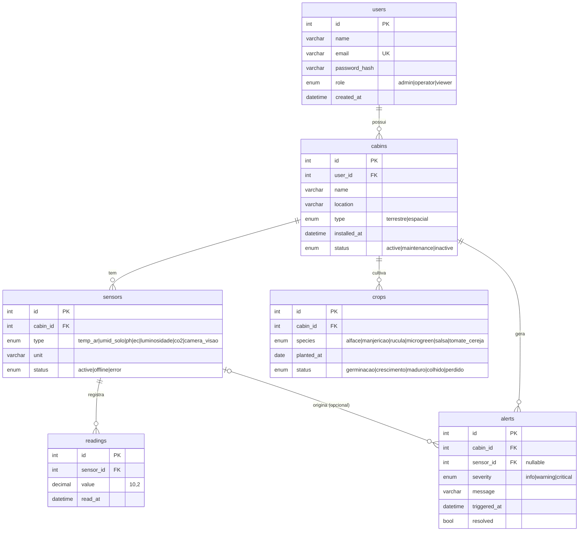

# Diagrama ER — Cabine API (P1 · Banco de Dados)

Modelo relacional do projeto **Cabine Autossuficiente** (Global Solution FIAP 2026/1).
São **6 entidades** (a rubrica exige ≥4) com chaves primárias, estrangeiras e índices.
O DDL correspondente está em [`sql/create_tables.sql`](../sql/create_tables.sql) e os models em
[`app/models.py`](../app/models.py).

## Diagrama (Mermaid)

> Renderiza automaticamente no GitHub e em editores com preview de Markdown.
> Para o PDF de entrega, dê um print deste diagrama **ou** exporte um PNG via dbdiagram.io (DBML abaixo).



## Relacionamentos

| De | Para | Cardinalidade | Chave |
|---|---|---|---|
| `users` | `cabins` | 1 : N | `cabins.user_id → users.id` |
| `cabins` | `sensors` | 1 : N | `sensors.cabin_id → cabins.id` |
| `cabins` | `crops` | 1 : N | `crops.cabin_id → cabins.id` |
| `cabins` | `alerts` | 1 : N | `alerts.cabin_id → cabins.id` |
| `sensors` | `readings` | 1 : N | `readings.sensor_id → sensors.id` |
| `sensors` | `alerts` | 0/1 : N | `alerts.sensor_id → sensors.id` (nullable) |

## Fonte DBML (dbdiagram.io)

Cole em **https://dbdiagram.io** → *Export* → PNG/PDF para gerar a imagem do diagrama.

```dbml
Table users {
  id int [pk, increment]
  name varchar(120)
  email varchar(160) [unique]
  password_hash varchar(120)
  role varchar [note: 'admin/operator/viewer']
  created_at timestamp
}
Table cabins {
  id int [pk, increment]
  user_id int [ref: > users.id]
  name varchar(120)
  location varchar(255)
  type varchar [note: 'terrestre/espacial']
  installed_at timestamp
  status varchar
}
Table sensors {
  id int [pk, increment]
  cabin_id int [ref: > cabins.id]
  type varchar [note: 'temp_ar/umid_solo/ph/ec/luminosidade/co2/camera_visao']
  unit varchar(20)
  status varchar
}
Table readings {
  id bigint [pk, increment]
  sensor_id int [ref: > sensors.id]
  value decimal(10,2)
  read_at timestamp [note: 'INDEX']
}
Table alerts {
  id int [pk, increment]
  cabin_id int [ref: > cabins.id]
  sensor_id int [ref: > sensors.id, null]
  severity varchar [note: 'info/warning/critical']
  message varchar(255)
  triggered_at timestamp
  resolved boolean
}
Table crops {
  id int [pk, increment]
  cabin_id int [ref: > cabins.id]
  species varchar
  planted_at date
  status varchar
}
```
